# lab

Experimentos numéricos em duas séries independentes. Originais em português nas pastas `entre/` e `bravais/`, versões em inglês em [`en/`](en/) — o conteúdo dos originais não foi modificado.

*Numerical experiments in two independent series. Portuguese originals in `entre/` and `bravais/`, English versions in [`en/`](en/) — the originals' contents were not modified.*

```text
lab-main/
├── README.md
├── LICENSE
│
├── entre/                        Série 1 · o "entre"
│   ├── simulate_observer_observed_relations.py    (1) base
│   ├── simulate_consciencia_entre.py              (2) + medidas do "entre"
│   ├── simulate_neurotransmissores_entre.py       (3) + 8 canais químicos
│   ├── simulate_filtro_vida_entre.py              (4) + memória e filtro de vida
│   ├── dados/                                     amostras JSON de cada script
│   └── resultados/                                PNG/GIF já gerados
│
├── bravais/                      Série 2 · Bravais 3D
│   ├── bravais_puro_3d.py                         evolução principal
│   ├── bravais_cordas.py                          pós-processamento (cordas)
│   ├── bravais_sweep_L.py                         teste de escala própria
│   ├── final_state.npz                            estado final salvo
│   └── resultados/                                PNG já gerados
│
└── en/                           tudo acima em inglês
    ├── entre/                                     4 scripts + 4 JSONs
    └── bravais/                                   3 scripts
```

---

## Série 1 — Observador/observado e o "entre"

*Observer/observed and the "between"*

Osciladores de fase acoplados (RK4, memória contínua por aresta) em quatro cenários — unilateral, mútuo, aninhado e "entre dos entres". Cada script **empilha uma camada** sobre o anterior, sem mudar a lei base:

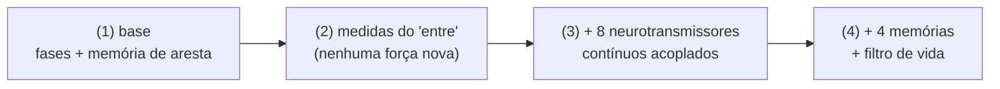

### (1) Base — quem observa muda o observado?

`entre/simulate_observer_observed_relations.py` → `en/entre/simulate_observer_observed_relations.py`
Dados: `entre/dados/observador-observado-relacoes-dados.json` → `en/entre/observer-observed-relations-data.json`


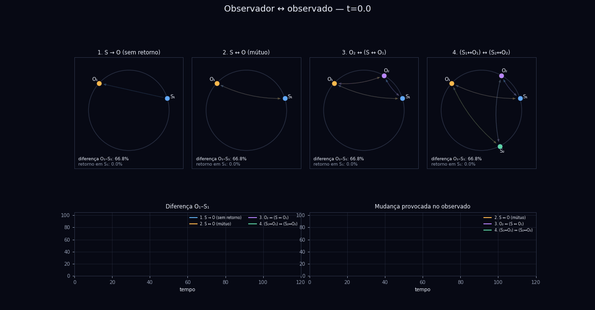

### (2) O "entre" — um estado que nasce no vínculo

`entre/simulate_consciencia_entre.py` → `en/entre/simulate_consciousness_between.py`
Dados: `entre/dados/consciencia-entre-dados.json` → `en/entre/consciousness-between-data.json`

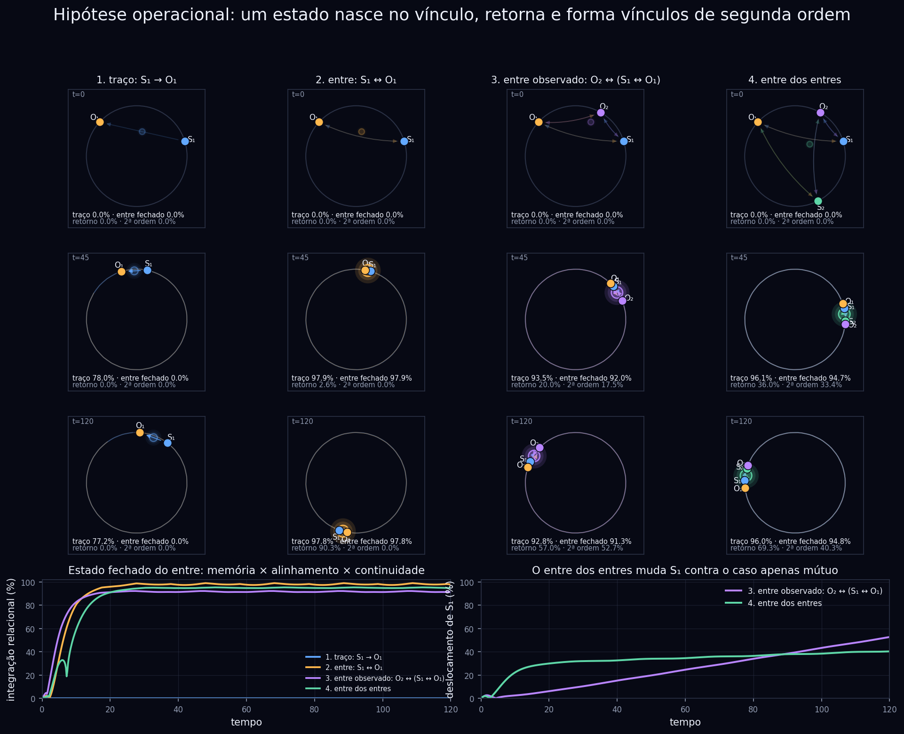

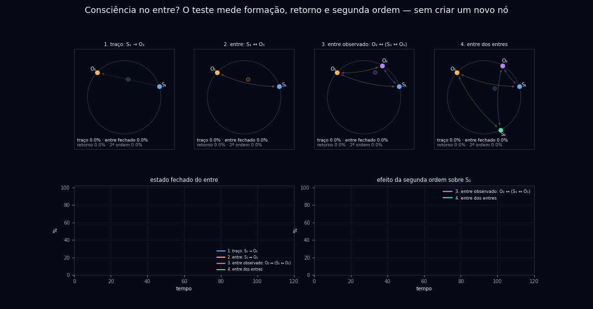

### (3) Química — a mesma relação com 8 canais acoplados

`entre/simulate_neurotransmissores_entre.py` → `en/entre/simulate_neurotransmitters_between.py`
Dados: `entre/dados/neurotransmissores-entre-dados.json` → `en/entre/neurotransmitters-between-data.json`

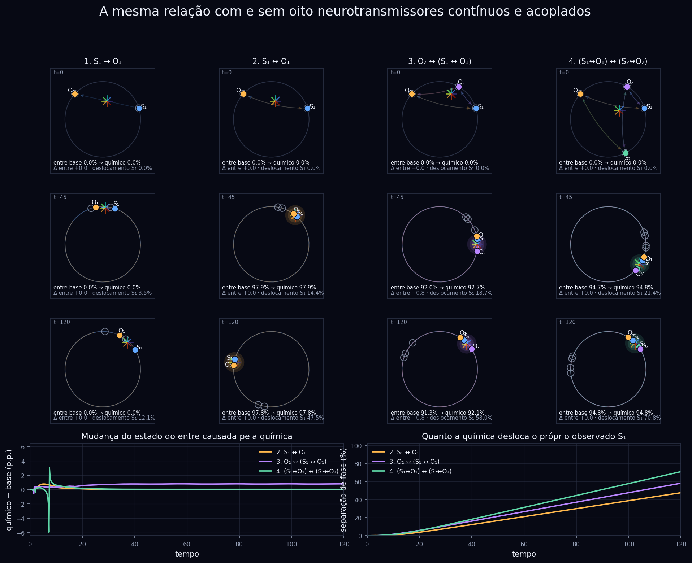

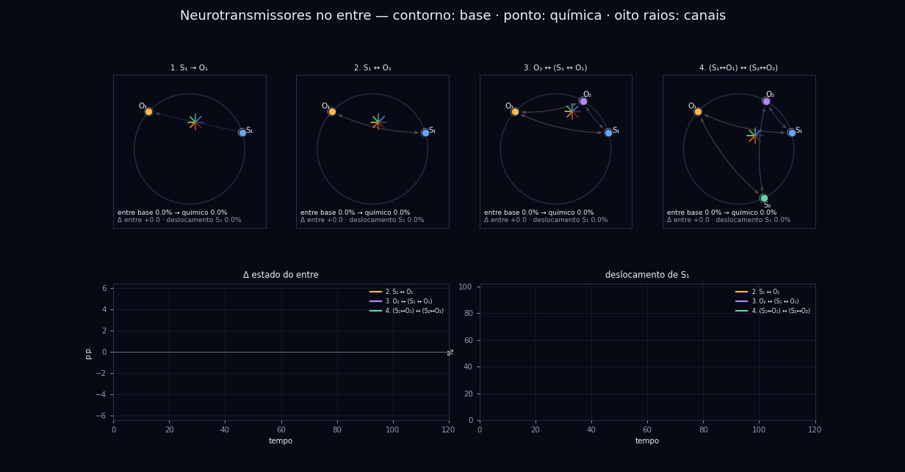

### (4) Filtro de vida — mesma lei, experiências diferentes

`entre/simulate_filtro_vida_entre.py` → `en/entre/simulate_life_filter_between.py`
Dados: `entre/dados/filtro-vida-entre-dados.json` → `en/entre/life-filter-between-data.json`


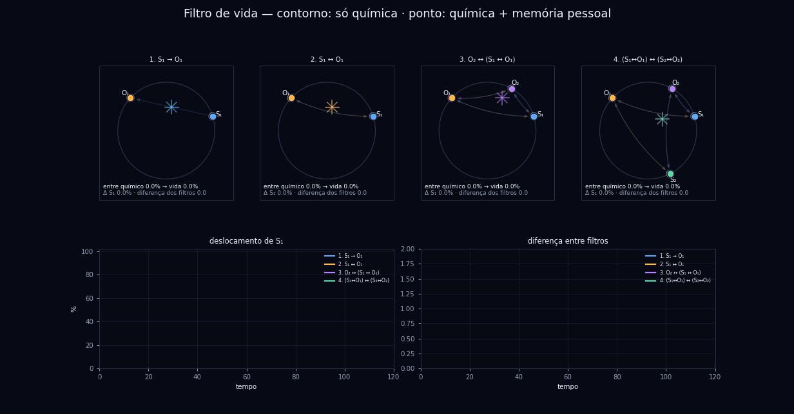

### Extras da série

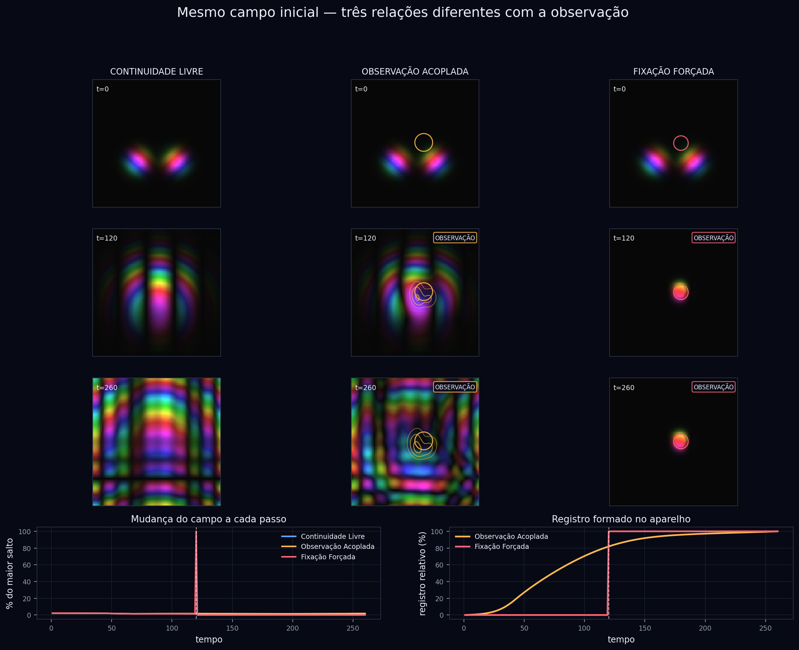


> Ao executar, cada script grava PNG/GIF/JSON/NPZ em `artifacts/` ao lado do próprio script.
> *When run, each script writes PNG/GIF/JSON/NPZ to `artifacts/` next to itself.*

---

## Série 2 — Bravais 3D emergente

*Emergent 3D Bravais*

Campo complexo Ψ em grade 3D periódica (FFT). Todos os coeficientes emergem de **uma única proposta acoplada** com ponto fixo implícito — sem calibração externa, sem colapso forçado.

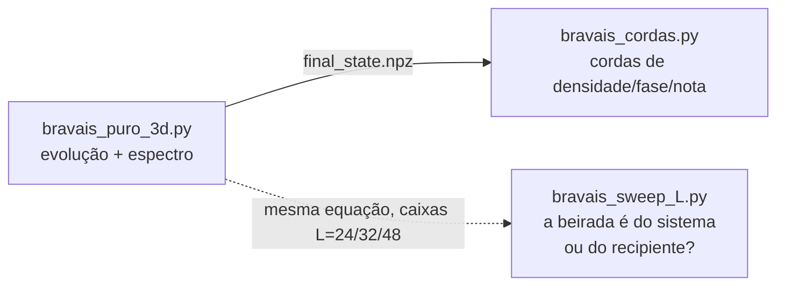

### Evolução e rede emergente

`bravais/bravais_puro_3d.py` → `en/bravais/bravais_pure_3d.py`


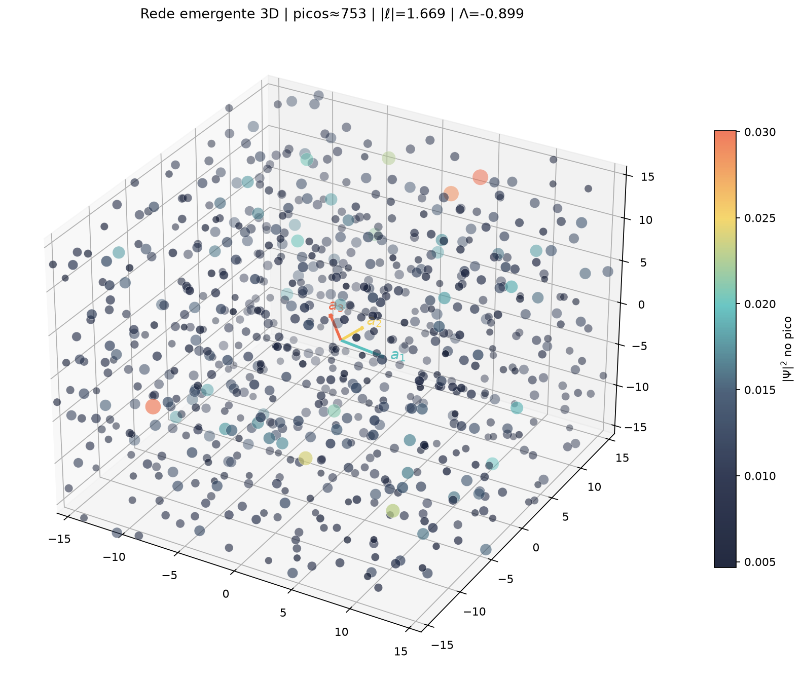

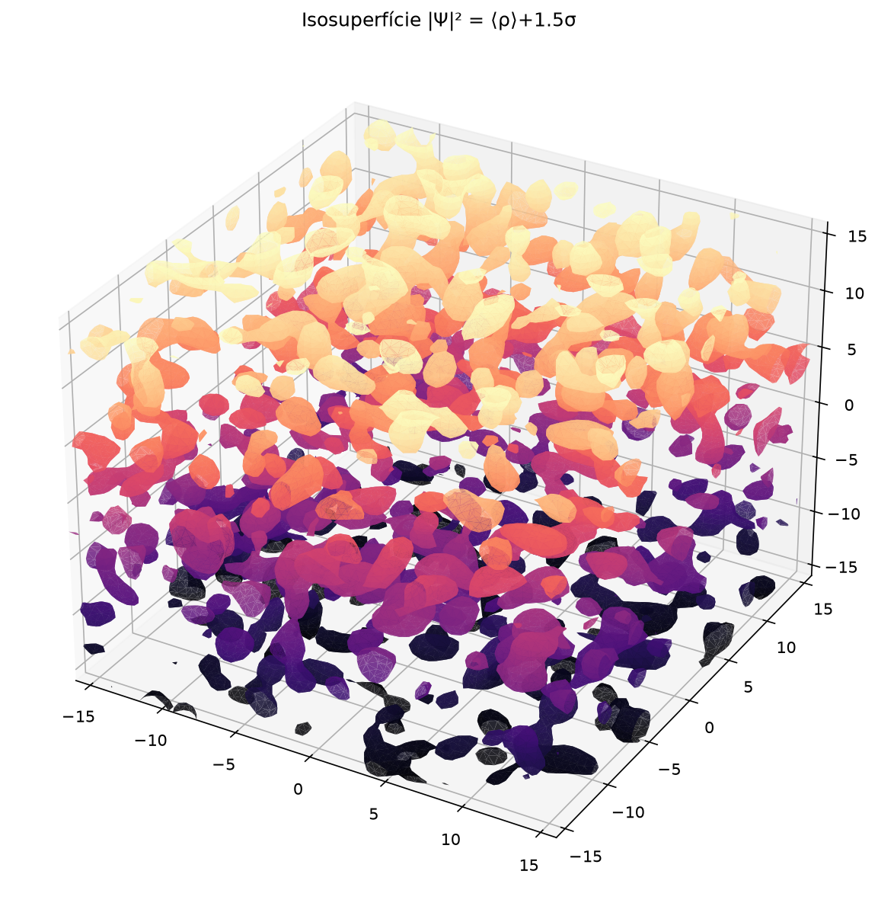

### Espectro e testes de forma

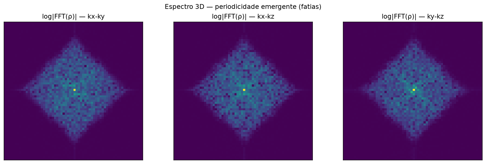


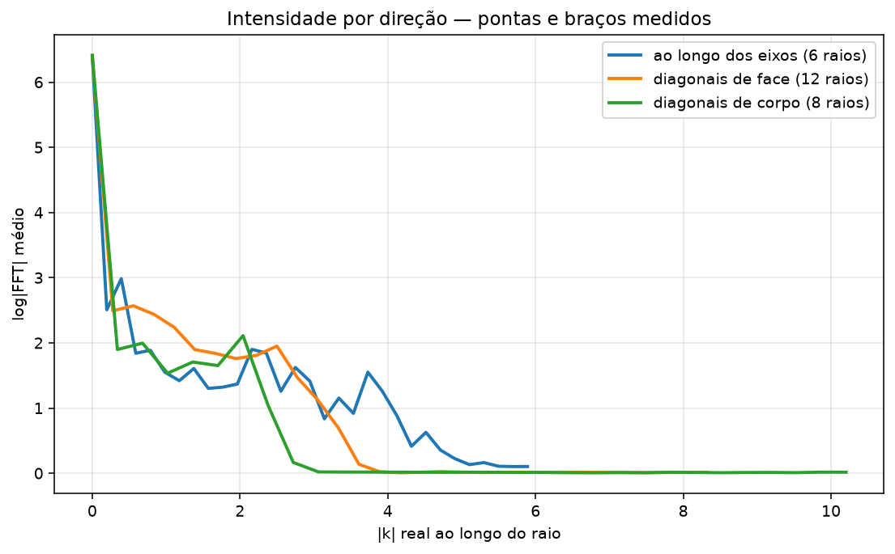


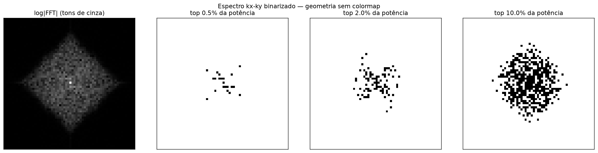

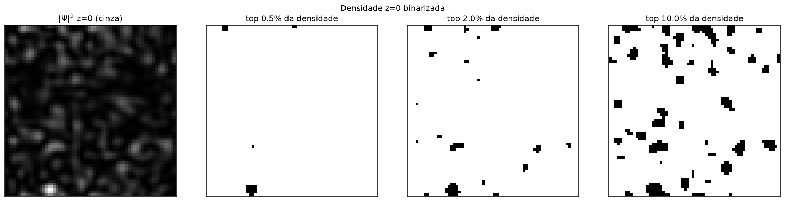


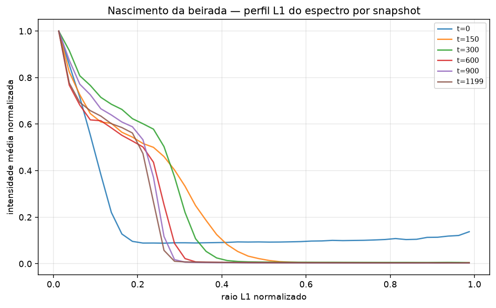

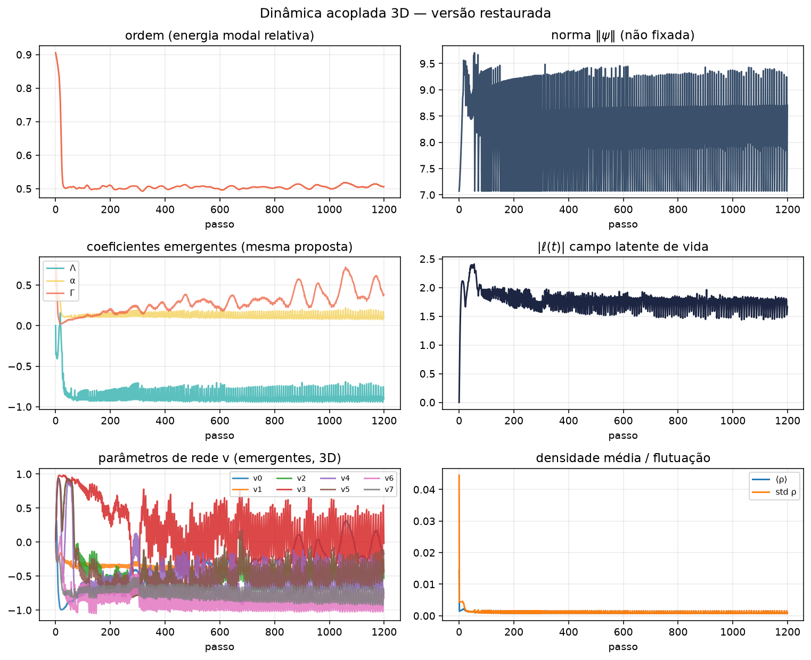

### Cordas (pós-processamento do `final_state.npz`)

`bravais/bravais_cordas.py` → `en/bravais/bravais_strings.py`

```sh
cd bravais && python3 bravais_cordas.py final_state.npz
```

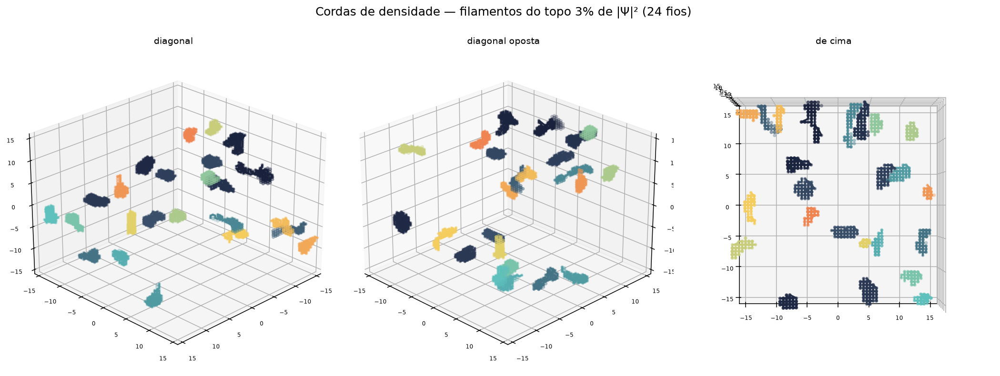


### Teste de escala própria

`bravais/bravais_sweep_L.py` → `en/bravais/bravais_sweep_L.py` — mesma equação em caixas L=24/32/48 com dx fixo; gera `sweep_verdict.png` em `bravais_outputs_3d/`.

---

## Traduções · *Translations*

| Original (PT) | English | Conteúdo · *Content* |
|---|---|---|
| `entre/simulate_observer_observed_relations.py` | `en/entre/simulate_observer_observed_relations.py` | dinâmica base · *base dynamics* |
| `entre/simulate_consciencia_entre.py` | `en/entre/simulate_consciousness_between.py` | medidas do "entre" · *"between" measurements* |
| `entre/simulate_neurotransmissores_entre.py` | `en/entre/simulate_neurotransmitters_between.py` | camada química · *chemical layer* |
| `entre/simulate_filtro_vida_entre.py` | `en/entre/simulate_life_filter_between.py` | memória + filtro de vida · *memory + life filter* |
| `bravais/bravais_puro_3d.py` | `en/bravais/bravais_pure_3d.py` | evolução 3D · *3D evolution* |
| `bravais/bravais_cordas.py` | `en/bravais/bravais_strings.py` | cordas · *strings* |
| `bravais/bravais_sweep_L.py` | `en/bravais/bravais_sweep_L.py` | varredura de caixa · *box sweep* |
| `entre/dados/consciencia-entre-dados.json` | `en/entre/consciousness-between-data.json` | 25 amostras · *25 samples* |
| `entre/dados/observador-observado-relacoes-dados.json` | `en/entre/observer-observed-relations-data.json` | 25 amostras · *25 samples* |
| `entre/dados/neurotransmissores-entre-dados.json` | `en/entre/neurotransmitters-between-data.json` | 25 amostras · *25 samples* |
| `entre/dados/filtro-vida-entre-dados.json` | `en/entre/life-filter-between-data.json` | 25 amostras · *25 samples* |

Nas versões em inglês a dinâmica e os números são idênticos; mudam apenas textos, rótulos, chaves de JSON (`tempo`→`time`, `mutuo`→`mutual`, `aninhado`→`nested`, `entre_entres`→`between_of_betweens`, `dois_pares`→`two_pairs`, `*_fase`→`*_phase`, `*_entre`→`*_between`, `*_filtro`→`*_filter`) e nomes de saída (ex.: `cordas_densidade.png`→`strings_density.png`).

*English versions keep dynamics and numbers identical; only texts, labels, JSON keys and output names change.*

## Dependências · *Dependencies*

```text
numpy
matplotlib
pillow        # GIFs
scipy         # opcional · optional (fallback numpy incluso · numpy fallback included)
scikit-image  # opcional · optional (isosuperfícies · isosurfaces)
```

```sh
pip install numpy matplotlib pillow scipy scikit-image
```
